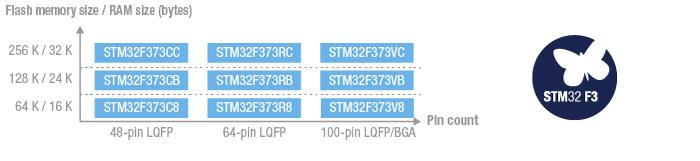
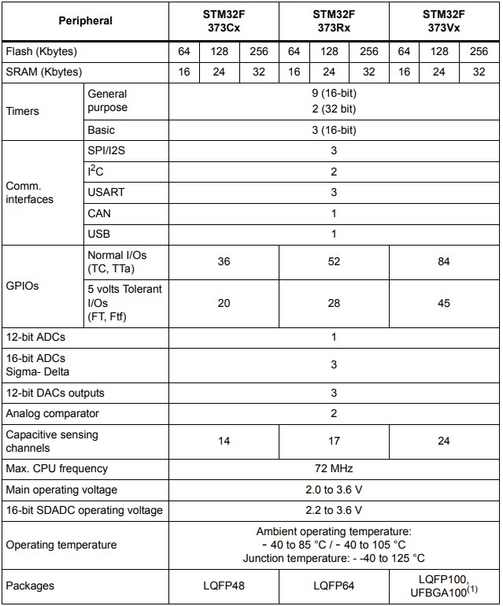

# [STM32F373](https://github.com/sochub/STM32F373) 
 
#### 父级：[STM32F3](https://github.com/sochub/STM32F3)
#### 架构：[Cortex M4](https://github.com/sochub/CM4) 
#### 收录芯片定级：[Level](https://github.com/sochub/Level)
### [STM32F373简介](https://github.com/sochub/STM32F373/wiki)

[STM32F373](https://github.com/sochub/STM32F373) 基于Cortex-M4的STM32F373产品线集成了16位的sigma-delta ADC，应用需要高精度的测量及强大的信号处理，该系列共有9款不同规格产品。

 

### 关键参数：

* 3 x 16位 sigma-delta ADC、多达21条单通道或11条差分通道、每条通道均具有7种可编程增益
* 采样率高达1M的12位ADC模块
* 多达2个比较器
* 多达3个12位DAC
* USB FS和CAN 2.0B通信接口

* ROM: 64 to 256 Kbytes
* GPIO: 48 to 100 pins

 

### [收录资源](https://github.com/sochub/STM32F373)

* [文档](docs/)
* [资源](src/)

### [关联资源](https://github.com/sochub)

* [编译工具](https://github.com/sochub/arm-none-eabi)

### [选型建议](https://github.com/sochub/STM32F373)

在STM32F3系列中[STM32F373](https://github.com/sochub/STM32F373)是唯一配备16位 sigma-delta ADC外设的型号，对于高精度ADC有需求的场景十分合适。

* 向下替换方案 [STM32F301](https://github.com/sochub/STM32F301) 

##  [SoC资源平台](http://www.qitas.cn)
