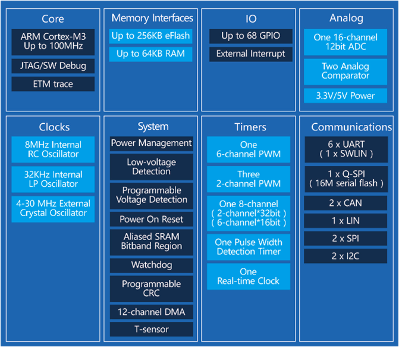

# [AC7815](https://github.com/SoCXin/AC7815)

* [autochips](http://www.autochips.com/)：[Cortex-M3](https://github.com/SoCXin/Cortex)
* [L4R4](https://github.com/SoCXin/Level) ：100 MHz * 1.25 DMIPS/MHz (285CoreMark)

## [简介](https://github.com/SoCXin/AC7815/wiki)

[AC7815](https://github.com/SoCXin/AC7815) 系列为车规MCU，符合AEC-Q100规范，适用于汽车电子和高可靠性工业应用，典型应用包括车身控制、T-BOX、BLDC电机控制、工业控制、交流充电桩等；具备出色的EMC/ESD能力，能够适应更恶劣的环境；

### 关键特性

* 2 x CAN 2.0B
* 温度范围: -40 to 125 °C

#### 封装规格

* LQFP80
* LQFP64

### [资源收录](https://github.com/SoCXin)

* [参考文档](docs/)
* [参考资源](src/)
* [参考工程](project/)

### [选型建议](https://github.com/SoCXin)

[AC7815](https://github.com/SoCXin/AC7815)

### [探索芯世界 www.SoC.xin](http://www.SoC.Xin)
